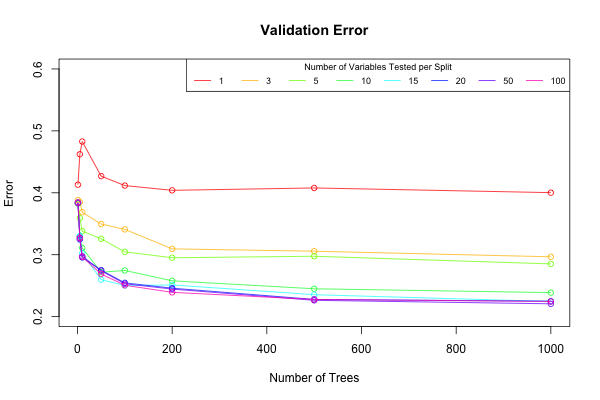
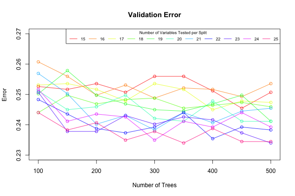
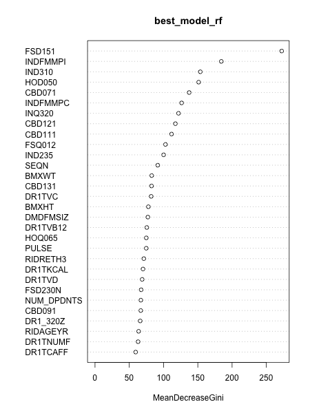

#### Classification: Random Forest Model
To build the random forest, we had to first create a way to find the optimal parameters for the model, namely `mtry` and  `ntrees`. Here, `mtry` means the number of variables tested at each split to provide the optimal split and `ntrees` means the total number of trees generated. Through these hyperparameters, we are able to tune the model to predict the most efficient possible. As a baseline to compare our results from the model, we calculated the error from predicting every value to being the most common food security level, 1, with an error rate of approximately 44%. Here, we calculated error by counting the number of misclassified datapoints and dividing that by the total number of data points.

The first step in tuning the model was to test a broad range of variables to test at each split of the tree as well as the number of trees for each split. As shown in Figure 1, we can see in the Validation Error table that we do not see much variation in error at around 20 variables tested at each split. Additionally, we can see that there is not much decrease in error after 100 trees.

**Figure 1: The plot represents the validation error from the first round of fine tuning, with each line representing a different number of variables tried at each split**

Using what we learned from the first round of fine tuning, we began the next round of fine tuning with a more narrow range of variables to test. In Figure 2, the Validation Error table shows that, while the error seems to remain in the range 0.23-0.27 for each `mtry` value, we see a minimum error value at 350 trees with 25 variables tested at each split.

**Figure 2: The plot represents the validation error from the final round of fine tuning, with each line representing a different number of variables tried at each split**

Using these learned hyperparameters, we built the final model and received a final classification test error of approximately 22.1%. As we can see from Figure 3, there were quite a few important variables in the random forest. The five variables that appear to have the most effect on the model are, in order, `FSD151`, `INDFMMPI`, `IND310`, `HOD050`, and `CBD071`. These variables represent the following data, household emergency food received, family monthly poverty level index, the total savings of the family, the number of rooms in the home, and money spent at the supermarket, respectively.

**Figure 3: The variable importance chart from the final model.**

